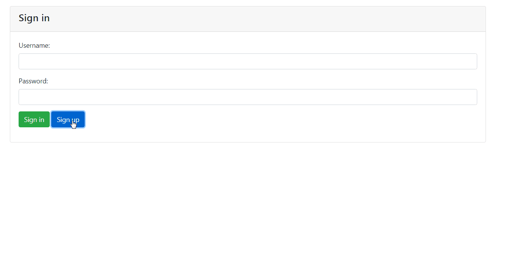
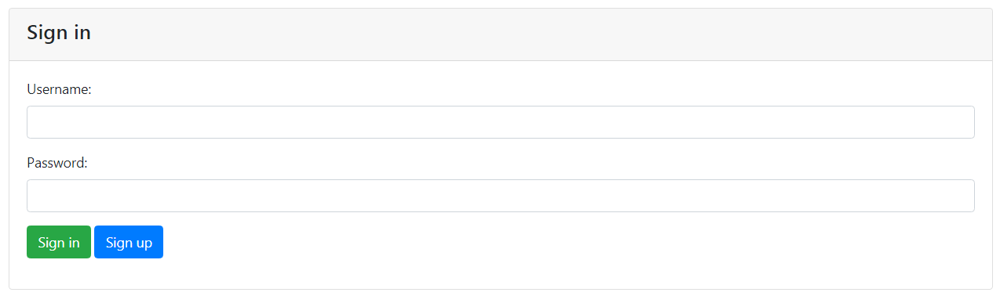
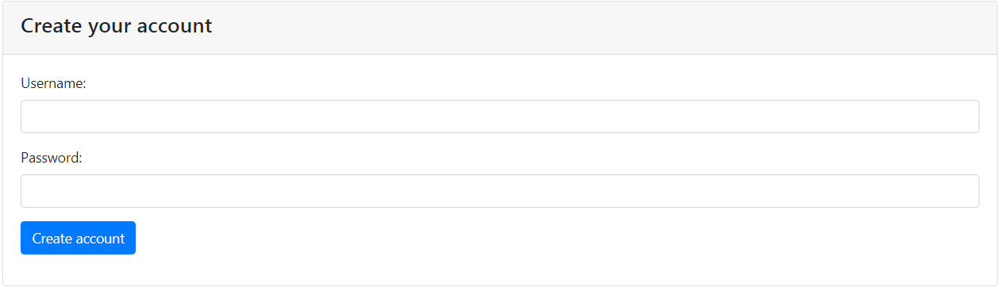
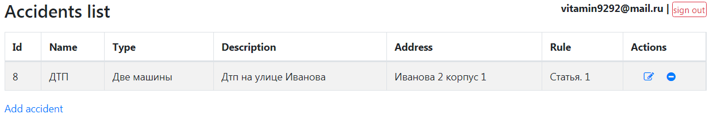
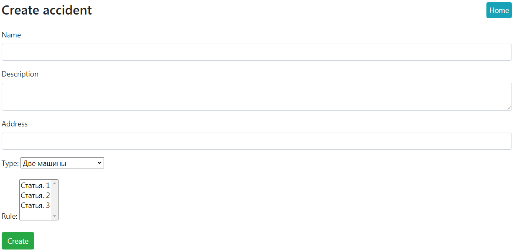
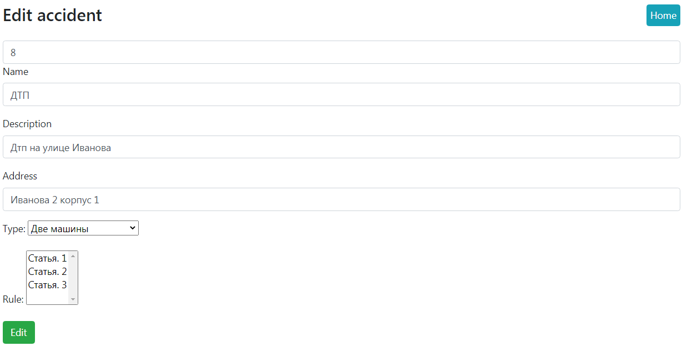

# job4j_car_accident

## О проекте
Приложение для информирования о дорожно-транспортных происшествиях.

## Стек
* Back-end
    * Java 15
    * Spring (MVC, Data, Security)
    * Apache Tomcat
    * Postgres
    * Maven

* Front-end
    * JS
    * Jsp

## Возможности
* Авторизация/регистрация. Проверка полей на корректный ввод данных. Данные хранятся в БД.
* Доступ только у авторизованных пользователей (реализовано через Spring Security).
* Создание/редактирование/удаление происшествий.

## Демо

### Car accident

### Авторизация

### Регистрация

### Главная страница

### Создание заявки

### Редактирование заявки

## Запуск проекта
Для того, чтобы запустить проект, нужно подключить Hibernate и postgres.
База данных должна называться auto_crash.
В корне проекта есть папка db с 2 схемами, которые создадут необходимые таблицы.

## Контакты
Если у вас остались вопросы, вы можете связаться со мной.
* Telegram: @vbgrishin